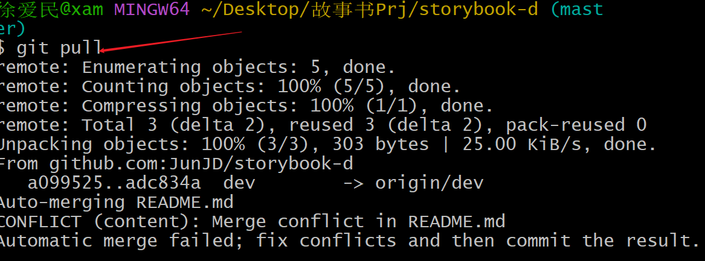
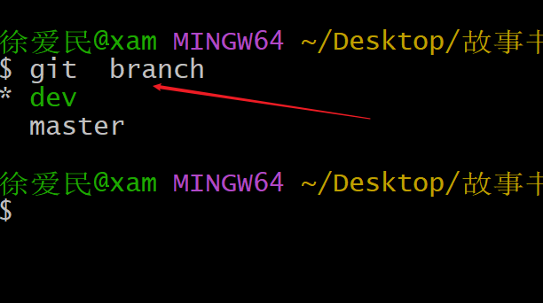

# git（版本控制软件）

## 生成公私钥：ssh-keygen 

## 代码仓库

（生僻词句）：

* 	Untracked files  未被跟踪的文件

*  	LF  换行

*	CRLF 回车换行


### **初始化**： **git init**   （initial）在某个文件夹初始化一个仓库（一份代码只执行一次）


#### 第一次使用时候：需要全局配置登录信息：**用户名**，**用户邮箱**

**git config --global user.name "xam"**

**git config --global user.email "1457007317@qq.com"**


### 查看当前仓库状态(暂存区 与工作目录)：  **git status**

```
**git status**
```


Changes not staged for commit：未提交的更改


### **将文件添加到暂存区：git add <file>**

### **将所有文件添加到暂存区：git add .**


### 还原某个文件(将文件从暂存区出来覆盖工作区对应文件)：git restore   < file >

：并不会提示相应合并信息而是直接合并  


### **提交:git commit  -m "commit message"**	

​	===>"first coomit"	--->提交信息

​	===> --m	==	--message


### **查看提交log日志：git log** 	

(查看当前仓库的提交记录，如果多的话可以通过上下键翻页)


### **查看工作目录与暂存区前后文件具体差异** ：**git diff**

#### GIt  bash here:

+表示增加

-表示删除

1.此处比较前后有无回车

2.行内末尾多余的空格

3.提示最后一行未添加换行


#### VScode中对比两个文件差异-->右键文件选中-选择以进行比较

绿色：新增


红色：删除


黄色：修改


#### **查看暂存区与最后一提交的具体差异：git diff --cached**


合并两个文件若无换行，拼接的时候会出错


#### git add -p：diff比较相应的修改进行暂存修改（自动识别）---进行原子性提交

（当代码变动时你想创建提交时，这个提交应该尽可能的小量，并且包含一个不可分割的特性（feature）、修复（fix）或优化（improved））

stage暂存


```
Stage this hunk [y,n,a,d,/,j,J,g,e,?]? ?

y - stage this hunk

n - do not stage this hunk

a - stage this and all the remaining hunks in the file

d - do not stage this hunk nor any of the remaining hunks in the file

g - select a hunk to go to

/ - search for a hunk matching the given regex

j - leave this hunk undecided, see next undecided hunk

J - leave this hunk undecided, see next hunk

k - leave this hunk undecided, see previous undecided hunk

K - leave this hunk undecided, see previous hunk

s - split the current hunk into smaller hunks

e - manually edit the current hunk

? - print help

Stage this hunk [y,n,q,a,d,/,j,J,g,e,?]? n
```


### 查看命令帮助: git hlep xxx 

```
git hlep xxx
```


### 回退版本/提交：

#### 回退到当前最新提交：git reset --hard HEAD

#### 回退到上次提交：git reset --hard HEAD^

#### 回退到上n次提交：git reset --hard HEAD~n

#### 回退到某次提交：git reset --hard commitid

#### 回到未来版本：git reset --hard commitid


### 撤销修改：

#### 1.工作区文件撤销没有提交到暂存区/没有git add

##### --git checkout 文件名

#### 2.将暂存区文件撤销到工作区

##### --git checkout 文件名

##### --git reset HEAD 文件不带--hard

#### 3.删除文件从版本库中删除文件

##### --git rm修改后需要提交


## GitHub上传操作(初次)

### 将仓库名添加进README.md文件中

```
echo "# learn-git" >> README.md
```

### 初始化仓库

```
git init
```

### 创建README.md文档（若仓库中有则不需要创建）

```
git add README.md
```

### commit提交

```
git commit -m "first commit"
```

### 重命名分支(将oldName设置成newName)

```
git branch -M main
```


### 添加一个远程仓库的地址: git remote add  origin 地址

--git remote add  地址

**origin（源）--是为后面的地址取的名字**

可以在仓库.git文件夹内.config文件中看到相应信息

```
git remote add origin git@github.com:AiMinXu/learn-git.git
```


### 查看远程仓库信息:git remote	(查看仓库)  git remote -v	（查看仓库信息）

```
git remote	(查看仓库)
git remote -v	（查看仓库信息）
```


### 删除远程仓库: git remote remove 仓库名字

```
git remote remove 仓库名字
```


### 将分支代码推送到对应仓库：git push （-u origin main）

```
git push -u origin main
```

 **将分支代码推送（上传）到对应仓库，同时将分支与远程仓库绑定，后续只需要git push即可推送**

-u(--set-upstream)

```
（git push -u 仓库名字 分支名字）
git push -u origin main
```

**确定公私密钥确定连接，需输入	yes**


### 将远程仓库最新修改更新到本地：git pull

```
git pull
```




### 更新远程仓库信息：git fetch

```
git fetch
```


### **将该文件夹作为仓库，不作为工作目录**：git init --bare

```
git init --bare
```


将该文件夹设置成仓库，并将拉取main分支代码到mycode仓库中

（注意地址中的 \ 需要改成 / 绝对路径）

```
git remote add mycode  C:/Users/徐爱民/Desktop/test-git/xxx
```


### 文件夹远程仓库状态： git log

```
git log
```


git push mycode mian已经执行过现在只需要git push

```
git push
```


### 查看当前分支：git branch

```
git branch
```




### 查看所有分支信息：git branch -a

```
git branch -a 
```


### 切换分支：git checkout  分支名

```
git checkout 分支名
```

### 创建分支：

#### 创建分支：git branch 分支名

**注意：在本地仓库操作，创建的都是本地分支**

```
git branch 分支名
```


#### 创建并切换分支：git checkout -b 分支名

**注意：在本地仓库操作，创建的都是本地分支**

```
git checkout -b 分支名
```


### 合并分支：

#### git merge 合并某分支到当前分支

```
git merge 合并某分支到当前分支
```


#### git merge --no-ff 分支名

```
git merge --no-ff 分支名
```


git rebase**若无特殊需要不建议使用**


### 删除分支：

#### 删除本地分支 ：

##### 删除未合并分支：git branch -D 分支名

##### 删除已合并分支：git branch -d 分支名

#### 删除远程分支：（此处建议界面操作）

##### git push origin -d 分支名

##### git push  -d 分支名